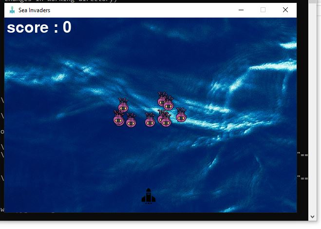

# Sea_invaders

Its the year 3047 and all of land is submerged under water. The remaining humans have followed and moved under water and in their usual fashion have ultered the ecosystem in the water. Unfortunately, this has risen the great and powerful sea fighters who have been dormant and has led to a battle between the remaining humans and the sea fighter.

It is your job as one of the most elite fighters to hold down this part of the human settlement and buy time for reinforcements to get to you.  

Can you do it?

Would you succed and go into the hall of fame?

Play and find out

## How to play
- Ensure you have python installed
- Run `pip install pygame` to install the pygame module
- Install git and clone this repository by running `git clone https://github.com/alahirajeffrey/sea-invaders`
- Open your termical and navigate to the cloned folder and run `python main.py`
- Once the game starts running, use your left or right arrow key to move your fighter ship and space bar to fire your gunship

